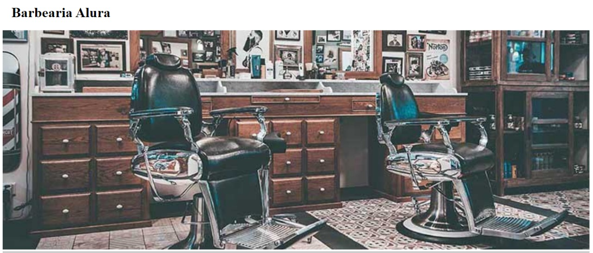

# Curso de HTML5 e CSS3 - Alura
***

Alura é uma plataforma que oferece diversos cursos pagos. Dentre estes, HTML5 e CSS3. Como em seus diversos cursos de formação, 
a parte prática do aprendizado requer o desenvolvimento de "produtos Alura". Aqui, o HTML e o CSS tornam-se os alicerces da nossa "Barbearia Alura".
Caso se interesse em conhecer a plataforma, acesse [Alura](https://www.alura.com.br/).

Aqui, estão a primeira e a segunda parte do curso, com suas respectivas imagens e arquivos de formação. 

**Primeira parte**

  "A primeira página da web", apresenta os fundamentos e a estrutura básica do HTML e CSS.
  

**Segunda parte** 

  "Posicionamentos, listas e navegação", ensina a navegação entre páginas web; a finalidade de um reset.css; a diferença entre inline e block e a utiliação de bordas.

